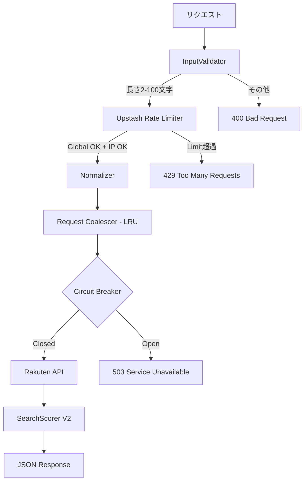

# Search Architecture V2.2: "The Fortress"

**Status**: APPROVED (Post-Adversarial Security Review)
**Owner**: Security Architect + Red Team
**Revision**: 2.2

---

## 1. Security Posture

| 脅威 | 対策 | 検証状況 |
|-----|------|---------|
| DDoS (Cold Start) | Upstash Redis (Global + IP) | ✅ Red Team承認 |
| API不正利用 | Rate Limiting Only (Origin削除) | ✅ Red Team承認 |
| IP Spoofing | x-real-ip (Vercel専用) | ✅ Red Team承認 |
| メモリ枯渇 | LRU Cache (max 100) | ✅ Red Team承認 |
| CPU枯渇 | クエリ100文字制限 | ✅ Red Team承認 |
| API障害 | Circuit Breaker (キャッシュなし) | ✅ Red Team承認 |

---

## 2. アーキテクチャ図



---

## 3. コンポーネント仕様

### 3.1. InputValidator
```typescript
const MIN_QUERY_LENGTH = 2;
const MAX_QUERY_LENGTH = 100;

function validate(query: string): ValidationResult {
  const trimmed = query.trim();
  
  if (trimmed.length < MIN_QUERY_LENGTH) {
    return { valid: false, error: 'QUERY_TOO_SHORT' };
  }
  if (trimmed.length > MAX_QUERY_LENGTH) {
    return { valid: false, error: 'QUERY_TOO_LONG' };
  }
  
  // サニタイズ: 文字・数字・空白のみ許可
  const sanitized = trimmed.replace(/[^\p{L}\p{N}\s]/gu, '');
  
  return { valid: true, query: sanitized };
}
```

### 3.2. Rate Limiter (Upstash)
```typescript
import { Ratelimit } from '@upstash/ratelimit';
import { Redis } from '@upstash/redis';

const redis = new Redis({
  url: process.env.UPSTASH_REDIS_REST_URL!,
  token: process.env.UPSTASH_REDIS_REST_TOKEN!,
});

// 二重制限
const globalLimit = new Ratelimit({
  redis,
  limiter: Ratelimit.slidingWindow(1000, '60 s'),
  prefix: 'ratelimit:global',
});

const ipLimit = new Ratelimit({
  redis,
  limiter: Ratelimit.slidingWindow(10, '60 s'),
  prefix: 'ratelimit:ip',
});

async function checkRateLimit(ip: string): Promise<boolean> {
  const [global, perIp] = await Promise.all([
    globalLimit.limit('global'),
    ipLimit.limit(ip),
  ]);
  return global.success && perIp.success;
}
```

### 3.3. IP取得 (Vercel専用)
```typescript
function getClientIP(request: NextRequest): string {
  // Vercelが設定するヘッダーのみ信頼
  return request.headers.get('x-real-ip') || 
         request.headers.get('x-vercel-forwarded-for')?.split(',')[0] || 
         'unknown';
}
```

### 3.4. Request Coalescer
```typescript
import { LRUCache } from 'lru-cache';

const inflightRequests = new LRUCache<string, Promise<SearchResult>>({
  max: 100,
  ttl: 10000, // 10秒
});

async function coalesceRequest(key: string, fn: () => Promise<SearchResult>) {
  const existing = inflightRequests.get(key);
  if (existing) return existing;
  
  const promise = fn();
  inflightRequests.set(key, promise);
  
  try {
    return await promise;
  } finally {
    inflightRequests.delete(key);
  }
}
```

### 3.5. Circuit Breaker
```typescript
class CircuitBreaker {
  private failures = 0;
  private lastFailure = 0;
  private readonly threshold = 3;
  private readonly resetTimeout = 30000; // 30秒
  
  isOpen(): boolean {
    if (this.failures >= this.threshold) {
      if (Date.now() - this.lastFailure > this.resetTimeout) {
        this.failures = 0; // Reset
        return false;
      }
      return true;
    }
    return false;
  }
  
  recordFailure(): void {
    this.failures++;
    this.lastFailure = Date.now();
  }
  
  recordSuccess(): void {
    this.failures = 0;
  }
}
```

---

## 4. 削除するコード

```diff
- import { supabase } from '@/lib/supabase';
- function validateOrigin(request: NextRequest): boolean { ... }
- const forwarded = request.headers.get('x-forwarded-for');
```

---

## 5. 依存関係追加

```bash
npm install @upstash/ratelimit @upstash/redis lru-cache
```

---

## 6. 環境変数追加

```env
UPSTASH_REDIS_REST_URL=https://xxx.upstash.io
UPSTASH_REDIS_REST_TOKEN=xxx
```

---

## 7. 前提条件

> ⚠️ **重要**: 本アーキテクチャはVercelへのデプロイを前提としています。
> 他のホスティング環境では `x-real-ip` ヘッダーの信頼性が異なるため、追加検証が必要です。
