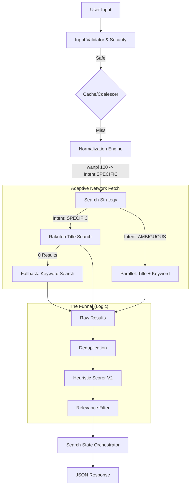

# Search Master Plan & Implementation Guide

**Status**: V2.2 (Refined by Red Team Critique)
**Context**: Consolidation of `SEARCH_ARCHITECTURE_V2.md` and `DRAFT_search-orchestration.ts` with Security V2.2.

---

## 1. Architecture Overview (The "Elegant Solution")

The search engine is an **Intent Predictor**, not just a database query. It prioritizes *what the user means* over strictly *what they typed*.

### Core Philosophy
*   **Speed**: Immediate feedback.
*   **Accuracy**: High relevance through intelligent scoring.
*   **Intent**: Recognizing aliases ("Wanpi" -> "ONE PIECE") and volume numbers ("Naruto 72").

### The Pipeline Flow (V2.2 Compliant)

---

## 2. Logic & Scoring Specification

### 2.1. The Funnel (Heuristic Scorer)
Every book starts at score **0**. Points are awarded based on intent matching.

| Criteria | Score | Reason |
| :--- | :--- | :--- |
| **Exact Title Bonus** | **+50** | `normalize(Book.Title).includes(normalize(Query))` |
| **Target Volume Match** | **+100** | User asked for "Vol 72", Book is "Vol 72" |
| **Volume 1 Bonus** | **+20** | User specified *no* volume, so we prefer Vol 1 (Entry point) |
| **Shortest Title** | **+10** | Prefers "Naruto" over "Naruto: The Movie Guide" |
| **Edition Penalty** | **-5** | Penalize `Bunko`, `Aizoban` in favor of standard `Tankobon` |
| **Adult Content Check** | **-1000** | Filter out R18 keywords if detected in title/genre |

### 2.2. Search States (The API Contract)
The frontend relies on these states to render the correct UI.

> [!NOTE]
> **Typo Strategy**: We currently rely on Rakuten's API to return *some* results for minor typos. Levenshtein is used to *rank* results that do populate, or to match Aliases to Results. If Rakuten returns nothing, we return `NOT_FOUND`. We do *not* currently have a client-side "Did you mean?" dictionary.

| State Type | Condition | UI Behavior |
| :--- | :--- | :--- |
| `CONFIDENT_MATCH` | Top Score > 80 | Show "Is this it?" modal or direct result. |
| `AMBIGUOUS_MATCH` | Top Score < 50 but hits | Show list: "Did you mean one of these?" |
| `TITLE_ONLY` | Alias known, but API empty | Show: "We know 'Wanpi' is One Piece, but found no stock." |
| `NOT_FOUND` | No hits pass filter | Show: "Sorry, try a different keyword." |

---

## 3. Implementation Plan

This plan consolidates the architecture, security, and draft logic into actionable steps.

### Phase 1: Foundation & Security (V2.2)
- [ ] **Install Dependencies**: `@upstash/ratelimit`, `@upstash/redis`, `lru-cache`.
- [ ] **Environment Setup**: Configure `UPSTASH_REDIS_REST_URL` and `TOKEN`.
- [ ] **Create Security Utilities**:
    - `src/lib/search/security/rate-limiter.ts` (IP & Global limits)
    - `src/lib/search/security/circuit-breaker.ts` (Rakuten API protection)

### Phase 2: Core Logic (V2 "The Funnel")
- [ ] **Create Normalizer**: `src/lib/search/core/normalizer.ts`
    - Implement Alias dictionary lookup.
    - Implement Volume number extraction (RegEx).
- [ ] **Create Scorer**: `src/lib/search/core/scorer.ts`
    - Implement the scoring matrix (Robust Title match, Vol match, etc.).
    - Implement `Levenshtein` distance helper.

### Phase 3: Orchestration & API (The Merger)
- [ ] **Create Orchestrator**: `src/lib/search/search-orchestrator.ts`
    - Port logic from `DRAFT_search-orchestration.ts`.
    - **Optimization**: Implement `Adaptive Network Fetch` (Title only vs Parallel).
    - **Resilience**: Implement "Soft Fallback" -> If `Specific` search yields 0 results, trigger `Keyword` search.
- [ ] **Refactor API Route**: `src/app/api/search/route.ts`
    - **Step 1**: Validate & Rate Limit.
    - **Step 2**: Normalize Query.
    - **Step 3**: Fetch from Rakuten (Wrapped in Circuit Breaker + Fallback Logic).
    - **Step 4**: Score & Sort.
    - **Step 5**: Determine State via Orchestrator.
    - **Step 6**: Return JSON.
- [ ] **Safety Config**: `src/lib/constants/blocked-keywords.ts`
    - Define `BLOCKED_KEYWORDS` array (R18/Offensive terms) for the -1000 penalty check.

### Phase 4: Verification
- [ ] **Unit Tests**: Test the Scorer with the "Test Scenarios" table (e.g., "Wanpi" -> ONE PIECE).
- [ ] **Manual Shield Test**: Verify Rate Limiter blocks spam.
- [ ] **UI Sync**: Ensure Frontend handles `CONFIDENT` vs `AMBIGUOUS` states correctly.

---

## 4. Verification Checklist

| Test Case | Input | Expected Outcome |
| :--- | :--- | :--- |
| **Alias** | "Wanpi" | Top result: "ONE PIECE" (Score > 80) |
| **Volume** | "Naruto 72" | Top result: "NARUTO 72" (Score > 100) |
| **Typo** | "Jujusu" | **Acceptable Failure** (Rakuten might miss). *Correction out of scope.* |
| **Security** | 10 requests/sec | 429 Too Many Requests |
| **Adult** | "Hentai" | Results filtered (Score -1000) or Empty |
